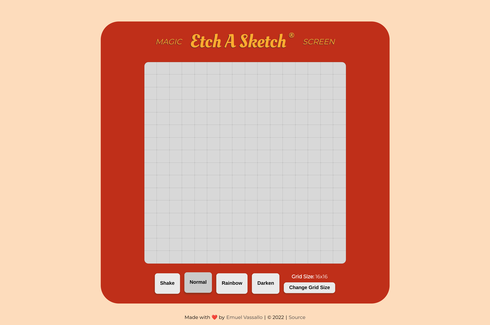

# Etch A Sketch

## Showcase

A website version of the [Etch A Sketch](https://en.wikipedia.org/wiki/Etch_A_Sketch) drawing toy, developed as per The Odin Project's [curriculum](https://www.theodinproject.com/lessons/foundations-etch-a-sketch).

## Live Demo

👉 **Preview**: https://emuel-vassallo.github.io/etch-a-sketch/

## Technologies

- HTML
- CSS
- JavaScript

## What I Learned

- Using a custom imported font
- Making an element shake using an animation
- Using event listeners with buttons
- Getting a random color
- Working with CSS grids

## Credits

- [Etch-A-Sketch Design](https://dribbble.com/shots/5718696-The-Creative-Pain-Basics) by Tyler Pate
